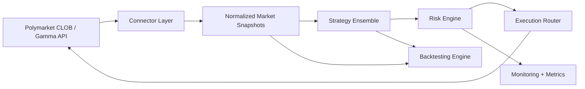

# PolyHFT-Autotrading-V3 Architecture

> [!WARNING]
> This is not financial advice. Trading involves substantial risk of loss. Past performance is not indicative of future results.

## Design Goals

PolyHFT-Autotrading-V3 is structured to preserve a clean path from research to execution:

1. Shared market-data models across live trading and backtesting.
2. Strategy modules that remain stateless at the interface boundary and deterministic for a given context.
3. Portfolio-first risk evaluation before any order reaches the venue adapter.
4. Explicit observability for trading, fill quality, and drawdown control.

## Component Map

## Runtime Pipeline

### 1. Market Data

The Polymarket connector consumes market-channel WebSocket updates for subscribed token IDs. When streaming quality degrades, the connector can fall back to public order-book polling. Incoming messages are normalized into `MarketSnapshot` objects with best bid, best ask, midpoint, imbalance, rolling volatility, and event metadata.

### 2. Signal Generation

Each strategy inspects the current snapshot plus portfolio context:

- Market making estimates fair value and posts two-sided interest around that level.
- Statistical arbitrage compares complementary YES/NO prices against the binary identity.
- Momentum tracks microstructure pressure and near-term breakout continuation.
- Mean reversion fades short-lived dislocations versus estimated fair value.

### 3. Risk Review

Signals are routed to the risk engine, which applies:

- Kelly-aware sizing using estimated probability edge and confidence.
- Volatility targeting using realized short-horizon dispersion.
- Hard caps on gross, net, and per-market exposure.
- Drawdown and daily-loss circuit breakers.

### 4. Execution

Approved orders are routed through the TypeScript execution surface. The current repository keeps the connector layer intentionally light, with room to plug in authenticated CLOB order placement, wallet signing, and post-trade reconciliation without changing the surrounding strategy or risk interfaces.

### 5. Monitoring

The monitoring layer provides:

- Structured logging to console and rotating log files.
- Lightweight dashboard rendering for equity, exposure, and latest signals.
- In-memory counters and latency statistics suitable for export into a larger monitoring stack.

## Research-to-Production Continuity

The same strategy and risk modules used in live mode are reused by the backtesting engine. This minimizes model drift between research notebooks and the deployed runtime and forces execution assumptions to stay explicit.
